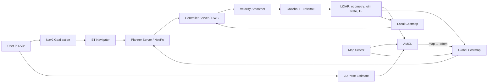

# Nav2 Phase 1: Architecture, TF, Topics, RViz, and Interview Guide

This guide explains the complete Phase 1 system: TurtleBot3 Waffle in Gazebo
Classic, localization with AMCL, path planning and control with Nav2, and
visualization and user input through RViz.

Use it in three ways:

1. Follow the hands-on exercises to learn the running system.
2. Use the tables as a reference while debugging.
3. Review the interview notes to practice explaining navigation clearly.

## 1. What Phase 1 contains

Phase 1 deliberately uses the standard ROS 2 Humble TurtleBot3 and Nav2
configuration. There is no custom robot, custom planner, SLAM, or parameter
tuning yet.

The system contains:

- **Gazebo Classic**: simulates the world, robot, wheels, LiDAR, physics, and
  simulated time.
- **robot_state_publisher**: publishes the robot's fixed and joint-dependent
  body transforms from its URDF.
- **map_server**: loads and publishes the saved occupancy-grid map.
- **AMCL**: estimates the robot pose in that map.
- **Global and local costmaps**: combine the static map and live sensor data
  into collision-cost grids.
- **Planner server**: calculates a route through the global costmap.
- **Controller server**: calculates safe short-term motion commands.
- **Behavior Tree navigator**: coordinates planning, control, replanning, and
  recoveries.
- **Velocity smoother**: limits abrupt changes in requested velocity.
- **Lifecycle managers**: configure and activate Nav2 nodes in order.
- **RViz**: visualizes ROS data and sends initial-pose and navigation requests.

## 2. The complete navigation loop



The important idea is that navigation is a **closed feedback loop**. Nav2 does
not calculate one velocity and assume the robot obeyed it. It repeatedly:

1. Estimates where the robot is.
2. Updates obstacle costs.
3. Replans or checks the global route.
4. Chooses a short-term velocity.
5. Observes the resulting movement through odometry and LiDAR.
6. Corrects the next command.

## 3. ROS concepts used in this phase

### Nodes

A node is a running ROS component with a focused responsibility. Examples are
`/amcl`, `/map_server`, `/planner_server`, and `/controller_server`.

### Topics

Topics are asynchronous streams. Publishers send messages without addressing
a particular receiver; any compatible subscriber can consume them. Examples
are `/scan`, `/odom`, `/map`, and `/cmd_vel`.

Use a topic for continuously changing data such as sensor readings or robot
velocity.

### Services

Services are short request/response calls. Gazebo's `/spawn_entity` service is
used to add the TurtleBot3 model to the simulated world. Nav2 also exposes
services for clearing costmaps and managing lifecycle nodes.

### Actions

Actions represent longer operations that provide feedback and can be
cancelled. A navigation request is an action, not just a pose topic:

```text
/navigate_to_pose  [nav2_msgs/action/NavigateToPose]
```

The action accepts a goal, reports feedback such as remaining distance, and
eventually succeeds, fails, or is cancelled.

### TF

TF is a time-aware tree of coordinate frames. It answers questions such as:
"Where was `base_link` relative to `map` at the timestamp of this laser scan?"

### Lifecycle nodes

Many Nav2 nodes use managed states:

```text
unconfigured → inactive → active → finalized
```

An installed or running process is not necessarily ready. A planner or
controller must be `active` before it serves navigation actions.

### QoS

ROS 2 Quality of Service controls delivery behavior. Two useful examples here:

- `/scan` is live sensor data and is consumed with **best effort** QoS. A late
  or dropped scan is normally less useful than the next scan.
- `/map` uses **transient local** durability. A new subscriber receives the
  latest saved map even if it was published earlier.

### Simulated time

Gazebo publishes `/clock`, and the nodes use `use_sim_time:=True`. Message
timestamps and TF lookups therefore follow simulated time, not the computer's
wall clock. If `/clock` stops, time-dependent navigation behavior stops too.

## 4. Coordinate frames in detail

The main frame chain is:

```text
map → odom → base_footprint → base_link → base_scan
                                  ├────→ imu_link
                                  ├────→ camera_link → camera frames
                                  ├────→ wheel_left_link
                                  └────→ wheel_right_link
```

The arrow means "the child frame is positioned relative to the parent." It
does not mean that messages flow along the arrow.

### `map`

- Global, world-fixed navigation frame.
- Origin comes from the map YAML file.
- Used by the global costmap, global planner, goals, and AMCL pose.
- Should remain stable instead of drifting with wheel odometry.

### `odom`

- Locally smooth frame produced by odometry.
- Good for continuous short-term motion and local control.
- Can accumulate drift over time on a physical robot.
- Must not jump suddenly because a controller depends on smooth motion.

### Why both `map` and `odom` are necessary

Wheel odometry is smooth but can drift. Map localization is globally corrected
but may adjust its estimate. ROS separates those properties:

- Gazebo's differential-drive plugin provides the smooth
  `odom → base_footprint` relationship.
- AMCL corrects global drift by publishing `map → odom`.

Conceptually:

```text
map → base = (map → odom) × (odom → base)
```

AMCL does **not** replace wheel odometry. It adjusts where the whole odometry
trajectory sits within the map.

### `base_footprint`

- A planar navigation frame at the robot's ground projection.
- Commonly excludes body height, roll, and pitch.
- AMCL uses it as the robot base frame in this stock configuration.

### `base_link`

- Main physical body frame defined by the URDF.
- Used as `robot_base_frame` by the costmaps and navigator here.
- Parent of sensor, camera, wheel, caster, and IMU frames.

### `base_scan`

- LiDAR frame.
- Every `/scan` range is expressed from this sensor pose.
- TF transforms scan points into `odom` or `map` before costmap insertion and
  map comparison.

### Static and dynamic transforms

- `/tf_static` contains transforms that do not change, such as
  `base_link → base_scan`.
- `/tf` contains changing transforms, such as `map → odom`, wheel/joint
  transforms, and `odom → base_footprint`.

A topic can exist while navigation still fails if its `frame_id` cannot be
connected through TF at the message timestamp.

## 5. Components and their contributions

| Component | Inputs | Outputs | Contribution |
| --- | --- | --- | --- |
| Gazebo physics | `/cmd_vel`, model/world files | simulated motion and `/clock` | Applies wheel motion and advances the world. |
| TurtleBot3 differential drive plugin | `/cmd_vel` | `/odom`, `odom → base_footprint` | Executes velocity commands and reports base motion. |
| TurtleBot3 LiDAR plugin | simulated geometry | `/scan` | Reports obstacle ranges around the robot. |
| `robot_state_publisher` | URDF and `/joint_states` | `/tf`, `/tf_static`, `/robot_description` | Places robot links and sensors in a consistent TF tree. |
| `map_server` | `turtlebot3_world.yaml` and PGM | `/map` | Publishes the saved global occupancy grid. |
| `amcl` | `/map`, `/scan`, odometry TF, `/initialpose` | `/amcl_pose`, `/particle_cloud`, `map → odom` | Localizes the robot within the saved map. |
| Global costmap | `/map`, `/scan`, TF | `/global_costmap/costmap` | Represents global free space, obstacles, and safety costs. |
| Planner server | global costmap and goal | `/plan` | NavFn computes a collision-aware global route. |
| Smoother server | computed path | smoothed path | Removes unnecessary roughness from paths when requested by the behavior tree. |
| Local costmap | `/scan`, TF | `/local_costmap/costmap`, footprint | Maintains a rolling 3 m × 3 m obstacle grid around the robot. |
| Controller server | global path, local costmap, `/odom`, TF | `/local_plan`, `/cmd_vel_nav` | DWB samples and scores short trajectories, then chooses a velocity. |
| Velocity smoother | `/cmd_vel_nav` | `/cmd_vel` | Enforces velocity and acceleration limits before execution. |
| Behavior server | local costmap, TF | `/cmd_vel` during recovery | Performs spin, backup, drive-on-heading, wait, and assisted teleoperation behaviors. |
| BT navigator | navigation action, odometry, server actions | orchestration and feedback | Coordinates planning, following, replanning, cancellation, and recovery. |
| Lifecycle managers | lifecycle services | state transitions | Automatically configure and activate localization and navigation nodes. |
| RViz | visualization topics | `/initialpose`, navigation actions | Visual interface; it does not perform planning or control itself. |

## 6. Important topic and action reference

The following endpoints are verified against this Phase 1 container.

| Interface | Type | Main producer | Main consumers | Meaning |
| --- | --- | --- | --- | --- |
| `/clock` | `rosgraph_msgs/Clock` | Gazebo | all simulated-time nodes | Current simulation time. |
| `/map` | `nav_msgs/OccupancyGrid` | map server | AMCL, global costmap, RViz | Saved world map. |
| `/scan` | `sensor_msgs/LaserScan` | LiDAR plugin | AMCL, both costmaps, RViz | Live obstacle ranges in `base_scan`. |
| `/odom` | `nav_msgs/Odometry` | differential drive plugin | controller, BT navigator | Smooth local pose and velocity estimate. |
| `/joint_states` | `sensor_msgs/JointState` | Gazebo plugins | robot state publisher | Current wheel/joint positions. |
| `/tf` | `tf2_msgs/TFMessage` | several nodes | all TF users | Changing transforms. |
| `/tf_static` | `tf2_msgs/TFMessage` | robot state publisher | all TF users | Fixed robot geometry transforms. |
| `/initialpose` | `PoseWithCovarianceStamped` | RViz | AMCL | Human-provided initial pose belief. |
| `/amcl_pose` | `PoseWithCovarianceStamped` | AMCL | monitoring tools | AMCL's estimated map-frame pose and uncertainty. |
| `/particle_cloud` | `nav2_msgs/ParticleCloud` | AMCL | RViz | Possible robot poses maintained by the particle filter. |
| `/global_costmap/costmap` | `OccupancyGrid` | global costmap | planner and RViz | Global collision-cost representation. |
| `/local_costmap/costmap` | `OccupancyGrid` | local costmap | controller and RViz | Rolling nearby collision-cost representation. |
| `/plan` | `nav_msgs/Path` | planner server | RViz | Visualization copy of the global route from current pose to goal. |
| `/local_plan` | `nav_msgs/Path` | controller server | RViz | Best short trajectory selected by DWB. |
| `/cmd_vel_nav` | `geometry_msgs/Twist` | controller server | velocity smoother | Raw navigation velocity request. |
| `/cmd_vel` | `geometry_msgs/Twist` | smoother or behavior server | differential drive plugin | Final command executed by the simulated robot. |
| `/navigate_to_pose` | `NavigateToPose` action | RViz action client | BT navigator | Goal request, feedback, result, and cancellation. |

### Why `/cmd_vel_nav` and `/cmd_vel` both exist

The controller's selected velocity is not sent directly to the wheels:

```text
controller_server → /cmd_vel_nav → velocity_smoother
velocity_smoother → /cmd_vel → Gazebo differential drive
```

Recovery behaviors may also publish directly to `/cmd_vel`. This is why more
than one publisher can appear on `/cmd_vel` even during normal operation.

The controller does not subscribe to the public `/plan` visualization topic.
The behavior tree passes the path to the controller through the `FollowPath`
action. This distinction is useful when reading `ros2 topic info -v /plan`:
seeing only RViz as a subscriber is normal.

## 7. What 2D Pose Estimate actually does

The **2D Pose Estimate** tool initializes or corrects localization. It does not
teleport the robot in Gazebo.

When using the tool:

1. The point where you press the mouse is the estimated `(x, y)` position in
   the RViz fixed frame, normally `map`.
2. The direction in which you drag sets the estimated yaw (heading).
3. Releasing the mouse publishes a
   `geometry_msgs/PoseWithCovarianceStamped` message on `/initialpose`.
4. The message includes uncertainty. In this RViz configuration the initial
   variance values are based on 0.25 for x/y and about 0.0685 for yaw.
5. AMCL distributes particles around that pose and heading.
6. AMCL compares predicted map obstacles with actual `/scan` observations.
7. Motion updates from odometry and measurement updates from LiDAR change the
   particle weights.
8. The particle cloud converges around the most likely pose.
9. AMCL publishes `map → odom`, connecting the global and local TF trees.

For this simulation the robot is spawned near `x = -2.0`, `y = -0.5`. Place
the estimate at the matching map location and drag in the direction the robot
faces.

### What if the estimate is wrong?

- A small error may be corrected as AMCL matches scans to the map.
- A large error or 180-degree heading error can make scans align with the wrong
  walls, prevent convergence, or make planning appear disconnected.
- Publish a new estimate; AMCL will reset its belief around the new pose.
- The Gazebo robot itself does not move when the estimate changes. Only the
  localization belief and `map → odom` correction change.

### Why dragging matters

A 2D pose contains position **and orientation**. A click without a meaningful
drag can provide the right position but the wrong yaw. The arrow points toward
the robot's forward `+x` direction.

## 8. What happens after a Nav2 Goal is given

The **Nav2 Goal** tool also uses click-and-drag:

- Mouse-down location: desired final `(x, y)` in the map.
- Drag direction: desired final yaw.
- Release: sends a `NavigateToPose` action goal to `/navigate_to_pose`.

The normal sequence is:

1. **BT navigator accepts the action.** It checks that required transforms and
   servers are available.
2. **Planner server computes a global path.** NavFn searches the global
   costmap from the current map-frame pose to the requested pose.
3. **The path appears on `/plan`.** In this RViz profile it is a red line with
   magenta pose arrows.
4. **Controller server receives the path.** DWB samples possible short motion
   trajectories using linear and angular velocity choices.
5. **DWB scores trajectories.** It considers obstacle collision, progress
   along the path, alignment, distance to the path and goal, oscillation, and
   final rotation.
6. **The best trajectory appears on `/local_plan`.** It is blue in this RViz
   profile.
7. **A velocity is published on `/cmd_vel_nav`.** The velocity smoother limits
   abrupt changes and publishes `/cmd_vel`.
8. **Gazebo executes the command.** The simulated wheels move the robot.
9. **Feedback closes the loop.** New `/odom`, TF, and `/scan` data update
   localization and costmaps, and the controller chooses the next command.
10. **The route can be replanned.** The default behavior tree periodically
    recomputes or validates the path as the pose and obstacles change.
11. **Goal checking finishes the action.** The stock tolerance is 0.25 m in
    position and 0.25 rad in yaw.

If progress fails, the behavior tree can clear costmaps and invoke behaviors
such as spinning, waiting, or backing up before trying again.

### Goal versus initial pose

| Tool | Meaning | Interface | Moves Gazebo robot immediately? |
| --- | --- | --- | --- |
| 2D Pose Estimate | "I believe the robot is here." | `/initialpose` topic to AMCL | No |
| Nav2 Goal | "Drive the robot here and finish facing this way." | `/navigate_to_pose` action | Starts navigation after planning |

## 9. RViz display and color guide

RViz is rendering several transparent layers at the same time. A pixel in a
screenshot can therefore be a blend of the map, global costmap, local costmap,
laser points, path, and particle cloud. Colors are display settings, not ROS
message semantics, and may change if the RViz profile is edited.

The exact stock profile used here contains:

| What you see | Configured appearance | Topic/display | Interpretation |
| --- | --- | --- | --- |
| Gray grid lines | gray, 50% alpha | RViz Grid | Scale and orientation reference in the XY plane. |
| White regions | occupancy-map free space, sometimes blended | `/map` | Space recorded as free in the saved map. |
| Black/dark wall cores | occupied map cells and lethal cost cells | `/map` plus costmaps | Robot center/footprint must not enter. |
| Gray map regions | unknown cells when visible | `/map` | The saved map has no free/occupied observation there. |
| Purple/red/pink/cyan halos | translucent costmap palette | global and local costmaps | Inflation and graded traversal cost around obstacles. |
| Red route | red line, 3 cm display width | `/plan` | Global path produced by NavFn. |
| Blue short route | blue line, 3 cm display width | `/local_plan` | DWB's selected short-term trajectory. |
| Small green arrows/dots | green flat arrows | `/particle_cloud` | AMCL pose hypotheses. Dense convergence is good. |
| Green polygon near robot | bright green outline | `/local_costmap/published_footprint` | Shape currently collision-checked for the robot. |
| Laser points | intensity/rainbow points, 3 px | `/scan` | Current LiDAR endpoints; they should align with walls. |
| Red/green/blue axes | standard TF axes | TF display | +X red, +Y green, +Z blue for each enabled frame. |
| Robot meshes | disabled by default in this profile | `/robot_description` | Can be enabled by checking `RobotModel`. |

### Understanding the costmap colors in the supplied screenshot

The screenshot has both costmaps enabled:

- **Global Costmap** uses alpha `0.3` and covers the mapped navigation area.
- **Local Costmap** uses alpha `0.7` and is a rolling 3 m × 3 m window around
  the robot.

This overlap makes the local square/window and obstacle halos look especially
strong. The dark obstacle cores are lethal or occupied. The surrounding
purple, red, pink, and cyan bands are decreasing inflation costs as distance
from the obstacle grows. The controller may traverse lower-cost cells, but it
prefers paths with more clearance when other scoring terms allow it.

Do not memorize one palette as a universal convention. To identify any layer
with certainty:

1. Expand **Global Planner** and **Controller** in the Displays panel.
2. Uncheck **Global Costmap** and observe what disappears.
3. Re-enable it and uncheck **Local Costmap**.
4. Toggle **Path**, **Local Plan**, **Amcl Particle Swarm**, **LaserScan**,
   **Polygon**, and **TF** one at a time.

That exercise is more reliable than guessing blended colors.

### How to judge whether localization is good

- Laser points overlap the corresponding map walls and obstacles.
- The particle cloud is concentrated around the robot rather than spread
  across the map.
- `map → odom → base_link` is connected in TF.
- The robot and local costmap move consistently within the global map.
- A planned path begins at the displayed robot pose.

## 10. Costmaps and obstacle inflation

An occupancy map answers "was this map cell observed as occupied?" A costmap
answers "how undesirable is it for the robot to occupy this cell now?"

This setup uses a robot radius of `0.22 m` and inflation radius of `0.55 m`.
Inflation adds a graded safety region around lethal obstacles. It does not make
the physical obstacle larger; it makes paths near it more expensive.

### Global costmap

- Frame: `map`.
- Covers the global mapped area.
- Layers: static map, live obstacle observations, inflation.
- Used by NavFn to compute `/plan`.
- Updates at 1 Hz in the stock configuration.

### Local costmap

- Frame: `odom`.
- Rolling window centered on the robot.
- Size: 3 m × 3 m at 0.05 m resolution.
- Layers: live voxel obstacles and inflation.
- Used by DWB for immediate collision avoidance.
- Updates at 5 Hz and publishes at 2 Hz.

### Marking and clearing

The LiDAR observation layer performs both:

- **Marking**: a measured endpoint can mark a cell as occupied.
- **Clearing**: the free ray from the sensor toward that endpoint can remove
  stale obstacle cells.

## 11. Planner, controller, and behavior tree

### NavFn global planner

The `GridBased` plugin is `nav2_navfn_planner/NavfnPlanner`. It searches the
global costmap for a low-cost path. In this stock configuration `use_astar` is
false, so NavFn uses its Dijkstra-style potential search.

The global planner decides **where the robot should travel through the map**.
It does not directly command wheel velocities.

### DWB local controller

The `FollowPath` plugin is `dwb_core::DWBLocalPlanner`. It samples short
trajectories for candidate velocity pairs, rejects collisions, scores the
remaining choices, and publishes the best command.

This TurtleBot3 configuration is non-holonomic:

```text
max_vel_x     = 0.26 m/s
max_vel_y     = 0.0 m/s
max_vel_theta = 1.0 rad/s
```

It can drive forward/backward and rotate, but it cannot command sideways
translation.

The controller decides **how the robot should move safely during the next
short interval while following the path**.

### Behavior Tree navigator

The behavior tree is the task-level coordinator. It calls the planner and
controller actions, monitors progress, reacts to updated goals, cancels work,
and selects recoveries. It separates high-level navigation policy from the
planner and controller algorithms.

## 12. Hands-on test sequence

### Test 1: basic localization

1. Set RViz **Fixed Frame** to `map`.
2. Select **2D Pose Estimate**.
3. Click near the robot's map position and drag in its forward direction.
4. Confirm the particle cloud converges and scan points align with walls.

Expected result: `map → odom` appears and map-frame warnings stop.

### Test 2: short open-space goal

1. Select **Nav2 Goal**.
2. Choose nearby open space.
3. Drag the arrow to set the final orientation.
4. Observe the red global path, blue local plan, `/cmd_vel`, and Gazebo robot.

Expected result: the robot follows the route and rotates to the requested yaw.

### Test 3: planning around an obstacle

Choose a goal with an obstacle between the robot and destination.

Expected result: the red global route bends through lower-cost free space
instead of crossing the inflated obstacle region.

### Test 4: deliberately invalid goal

Place a goal inside a wall or lethal-cost cell.

Expected result: planning fails, recovery is attempted, or the action is
aborted. Cancel and choose free space.

### Test 5: dynamic obstacle

While navigating, place or move an object into the route in Gazebo.

Expected result: `/scan` marks the obstacle in the local costmap. DWB changes
trajectory, slows, stops, or waits; global replanning may choose a new route.

### Test 6: localization error and recovery

Publish a slightly wrong 2D pose estimate and compare the laser points with
the walls. Then correct it.

Expected result: the particle cloud and `map → odom` correction change, but
the physical Gazebo model does not teleport.

## 13. Inspection commands

Open a shell inside the running container:

```powershell
cd D:\GitHub\nav2_stack\nav2_phase1_docker
docker compose exec nav2 bash
```

Then source ROS:

```bash
source /opt/ros/humble/setup.bash
```

### Discover the graph

```bash
ros2 node list
ros2 topic list
ros2 service list
ros2 action list -t
```

### Inspect live data

```bash
ros2 topic echo /scan --once
ros2 topic echo /odom --once
ros2 topic echo /amcl_pose --once
ros2 topic echo /cmd_vel
ros2 topic echo /plan --once
```

### Find publishers and subscribers

```bash
ros2 topic info -v /scan
ros2 topic info -v /cmd_vel_nav
ros2 topic info -v /cmd_vel
```

### Inspect TF

```bash
ros2 run tf2_ros tf2_echo map odom
ros2 run tf2_ros tf2_echo odom base_footprint
ros2 run tf2_ros tf2_echo map base_link
ros2 run tf2_tools view_frames
```

### Check lifecycle states

```bash
ros2 lifecycle get /amcl
ros2 lifecycle get /controller_server
ros2 lifecycle get /planner_server
ros2 lifecycle get /bt_navigator
```

Each navigation component should eventually report `active [3]` after
localization is established.

## 14. Troubleshooting by symptom

| Symptom | Likely cause | What to inspect |
| --- | --- | --- |
| No `/clock` data | Gazebo is not advancing | Gazebo process and container logs. |
| No `/scan` messages | Robot/LiDAR plugin did not spawn | `ros2 topic info -v /scan`, Gazebo model. |
| No `/odom` messages | Differential-drive plugin or robot spawn failed | `/odom`, `/cmd_vel`, container startup log. |
| `base_link` to `odom` missing | No odometry TF | `/odom`, TF tree, robot spawn. |
| `map` frame missing before initialization | AMCL has no initial pose yet | Use **2D Pose Estimate**. |
| Particle cloud stays broad | Poor initial pose or ambiguous scans | Correct x/y/yaw and inspect scan alignment. |
| Laser points do not line up with walls | Wrong localization or broken sensor TF | `map → base_scan`, initial pose, timestamps. |
| No global path | Invalid goal, inactive planner, or blocked global costmap | Goal cell, `/plan`, planner lifecycle and logs. |
| Global path exists but robot does not move | Controller inactive or no command path | `/local_plan`, `/cmd_vel_nav`, `/cmd_vel`. |
| `/cmd_vel` changes but robot does not move | Gazebo drive subscriber/plugin problem | `/cmd_vel` publisher/subscriber details. |
| Robot oscillates or gets stuck | Local trajectory scoring, inflation, footprint, or localization issue | Local costmap, DWB trajectories, particle cloud. |
| Goal reached in position but robot keeps turning | Final yaw has not met tolerance | Goal arrow orientation and yaw error. |
| RViz drops messages before initial pose | TF cannot transform them into `map` yet | Initialize AMCL; verify `map → odom`. |

## 15. Interview-ready explanations

### "Explain `map`, `odom`, and `base_link`."

`map` is the globally corrected, world-fixed frame used for goals and global
planning. `odom` is a locally smooth frame driven by odometry that can drift.
`base_link` is attached to the robot body. Odometry supplies the transform from
`odom` to the robot, while AMCL publishes `map → odom` so the robot is globally
localized without introducing jumps into local odometry.

### "What is the difference between localization and odometry?"

Odometry integrates motion over time and is smooth but accumulates error.
Localization compares sensor observations with a known map to estimate a
globally meaningful pose. In this system AMCL fuses the odometry motion model
with LiDAR-to-map likelihoods.

### "What is the difference between a map and a costmap?"

The occupancy map is a stored estimate of free, occupied, and unknown space.
A costmap is a navigation-specific grid built from the map and live sensors,
with lethal obstacles and inflated graded costs that account for robot size
and preferred clearance.

### "Global planner versus local controller?"

The global planner computes a route across the map. The local controller
repeatedly selects collision-free short-term velocities that follow that route
using the current local costmap and robot motion. Planning answers "where";
control answers "how to move now."

### "What happens when 2D Pose Estimate is used?"

RViz publishes a map-frame pose with covariance on `/initialpose`. AMCL resets
its particle distribution around that belief, scores particles using LiDAR and
the map, and publishes the `map → odom` correction. It does not teleport the
physical or simulated robot.

### "What happens when a navigation goal is sent?"

RViz sends a cancellable `NavigateToPose` action containing target position
and yaw. The BT navigator requests a global path, sends it to the controller,
monitors feedback, triggers replanning or recovery when needed, and completes
when position and orientation tolerances are satisfied.

### "Why is TF time-aware?"

Sensors and odometry arrive at different times while the robot is moving. A
laser scan must be transformed using the robot pose at the scan timestamp, not
its newest pose. TF stores a time history so nodes can make that query.

### "Why use an action for navigation?"

Navigation takes time, needs feedback, can be cancelled, and can succeed or
fail. Those semantics match a ROS action better than a one-way topic or a
short blocking service.

### "How does Nav2 avoid obstacles?"

LiDAR observations mark and clear obstacle cells. Inflation adds graded safety
cost. The global planner routes through the global costmap, while DWB samples
short trajectories and rejects or penalizes candidates that collide or pass
too close to local obstacles.

## 16. Scope and limitations of this phase

This phase proves the standard known-map navigation pipeline. It does not yet
prove:

- Building a map with SLAM.
- Accurate localization with noisy physical sensors.
- Real motor control, wheel slip handling, or hardware safety.
- Custom footprint and costmap tuning.
- A custom robot URDF or drivetrain.
- Multi-robot navigation.

Those limitations are useful interview context: a successful simulation is a
pipeline validation, not proof that the same parameters are production-ready
on a physical robot.

## 17. A compact mental model

If only one sequence is remembered, use this:

```text
Map + LiDAR + odometry
        ↓
AMCL estimates map → odom
        ↓
Goal + global costmap → global path
        ↓
Global path + local costmap + odometry → local velocity
        ↓
Velocity smoother → /cmd_vel → robot
        ↓
New odometry + LiDAR close the feedback loop
```
