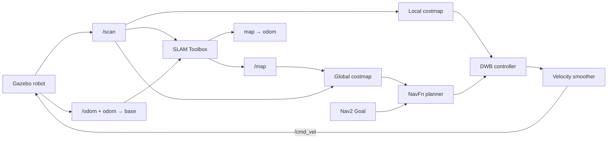

# Nav2 Phase 2: SLAM, Navigation, and Interview Guide

Phase 2 uses the same TurtleBot3, Gazebo, Nav2 planner, controller, costmaps,
behavior tree, and RViz foundation as Phase 1. The localization side changes:
SLAM Toolbox builds a new occupancy map while estimating the robot trajectory.

## 1. Phase 1 versus Phase 2

| Question | Phase 1 | Phase 2 |
| --- | --- | --- |
| Is a map known at startup? | Yes | No |
| Who publishes `/map`? | `map_server` | `slam_toolbox` |
| Who publishes `map → odom`? | AMCL | SLAM Toolbox |
| Is `/initialpose` required? | Yes | No |
| Can the occupancy map grow? | No | Yes |
| Can Nav2 run? | Yes | Yes, in observed free space |
| Can mapping resume losslessly later? | Not from PGM/YAML alone | Yes, from the serialized pose graph |

Only one localization system should own `map → odom`. Running AMCL and SLAM
Toolbox together in mapping mode would create conflicting transforms.

## 2. Phase 2 data flow



SLAM and navigation run concurrently. Each movement creates new sensor data;
SLAM can extend or correct the map, and Nav2 consumes the latest map through
the global costmap.

## 3. What SLAM estimates

SLAM means **Simultaneous Localization and Mapping**. The system estimates two
coupled unknowns:

1. The robot trajectory through the environment.
2. The arrangement of obstacles observed along that trajectory.

The main inputs are:

- `/scan`: current LiDAR ranges in `base_scan`.
- `odom → base_footprint`: smooth short-term motion from the drive plugin.
- Static sensor TF such as `base_link → base_scan`.

The main outputs are:

- `/map`: a growing `nav_msgs/OccupancyGrid`.
- `map → odom`: the global correction that places odometry in the SLAM map.
- Pose-graph nodes, constraints, scans, and interactive visualization topics.

## 4. Scan matching, odometry, and pose graph

### Odometry prediction

Odometry predicts how far the robot moved between scans. It provides a useful
initial guess but can drift.

### Scan matching

SLAM Toolbox aligns a new laser scan with nearby existing observations. The
best alignment refines the estimated pose. Good odometry narrows the search;
LiDAR alignment corrects odometry error.

### Pose graph

The mapping history is represented as a graph:

- A **node** represents a robot pose with an associated laser scan.
- An **edge/constraint** says how two poses should relate.
- Sequential constraints come from nearby motion and scan matching.
- Loop-closure constraints connect places observed at different times.

An optimizer adjusts poses to satisfy the constraints consistently. The
occupancy map is rasterized from the optimized poses and scans.

This configuration records a new scan node after roughly `0.25 m` of travel or
`0.25 rad` of rotation. Smaller thresholds make a short demo visibly update
but increase computation and graph size.

## 5. Loop closure

Loop closure occurs when the robot recognizes a previously mapped location.
The new constraint can correct accumulated drift across the entire trajectory.

What may be visible in RViz:

- Walls shift slightly into better alignment.
- A corridor that looked doubled merges.
- `map → odom` changes while `odom → base` remains smooth.
- The global costmap resizes or refreshes from the corrected `/map`.

Loop closure does not mean odometry becomes perfect. It means the global map
and trajectory are optimized using a revisited-place constraint.

## 6. Why 2D Pose Estimate is not used

In Phase 1, AMCL needs a human-provided belief about where the robot sits in a
pre-existing map. In a new SLAM session, there is no old map frame to locate
against. SLAM Toolbox creates the map frame around the current trajectory and
publishes `map → odom` itself.

Therefore:

- Do not use **2D Pose Estimate** during a fresh mapping session.
- The absent AMCL particle display is expected.
- A continued serialized map uses SLAM Toolbox's deserialize/start mechanisms,
  not the normal AMCL initialization workflow.

## 7. Navigation in an unknown environment

"Navigation while mapping" does not imply automatic exploration.

Nav2 can plan through cells currently represented as reachable in the global
costmap. It cannot safely invent a route through unseen walls. For this lab:

1. Use teleoperation to expose a useful region.
2. Send Nav2 goals inside observed free space.
3. Map more space manually or with additional reachable goals.

An autonomous explorer is a separate decision-making component that selects
frontiers between known free and unknown space, sends goals, and repeats.

Interview distinction:

```text
SLAM:        build the map and estimate pose
Nav2:        reach a requested goal safely
Exploration: decide which unknown region to visit next
```

## 8. What happens when a goal is sent

1. RViz sends a `NavigateToPose` action goal in `map`.
2. The BT navigator asks NavFn for a route through the latest global costmap.
3. The global costmap incorporates the current SLAM map and live scan data.
4. DWB samples short trajectories using the rolling local costmap.
5. The velocity smoother publishes the final `/cmd_vel`.
6. Gazebo moves the robot and publishes new odometry and scans.
7. SLAM processes sufficiently separated scans and updates its graph/map.
8. Nav2 can replan against the updated global representation.

A goal in unknown or occupied space may be rejected or aborted. That is not a
SLAM failure; the requested route is not currently known to be traversable.

## 9. RViz interpretation

Most Phase 1 displays retain the same meaning:

- `/map`: now generated live by SLAM Toolbox.
- Red `/plan`: global route through the current mapped area.
- Blue `/local_plan`: selected DWB trajectory.
- Global/local costmap colors: lethal and inflated collision costs.
- Laser points: current observations; alignment with the growing map indicates
  healthy SLAM.
- TF axes: should form `map → odom → base_footprint → base_link → base_scan`.

Expected differences:

- The map begins small and changes as the robot moves.
- **Amcl Particle Swarm** has no data and should be disabled.
- No 2D Pose Estimate is required.
- Map corrections may move already drawn walls slightly after optimization.

## 10. Occupancy map versus serialized pose graph

The save helper creates two forms of persistence.

### Occupancy map

```text
name.yaml
name.pgm
```

This is the flattened free/occupied/unknown image plus resolution and origin.
Use it with map server and AMCL for Phase 1-style known-map navigation.

### Serialized SLAM state

```text
name.posegraph
name.data
```

Keep both files together. They preserve graph structure and sensor data needed
to reload, continue, refine, or manipulate the mapping session.

Saving only PGM/YAML is analogous to saving a rendered result. Serializing the
pose graph saves the underlying editable mapping model.

## 11. Practical test plan

### Test A — Architecture ownership

```bash
ros2 node list
ros2 topic info -v /map
ros2 run tf2_ros tf2_echo map odom
```

Pass criteria:

- `/slam_toolbox` exists.
- `/amcl` and `/map_server` do not exist.
- SLAM Toolbox is the only `/map` publisher.
- The `map → odom` transform is available.

### Test B — Sensor foundation

```bash
ros2 topic echo /scan --once
ros2 topic echo /odom --once
ros2 run tf2_ros tf2_echo odom base_footprint
```

Pass criteria: live timestamps advance and sensor frames connect to the base.

### Test C — Map growth

Record map metadata, drive into a new area, and inspect it again:

```bash
ros2 topic echo /map --once --field info
```

Map width/height/origin may change when observations exceed current bounds.
Even if dimensions remain constant, occupancy values and pose-graph node count
can change as newly observed cells are filled.

### Test D — Navigation while mapping

Send a short goal in visible free space. Confirm:

- `/plan` and `/local_plan` publish.
- `/cmd_vel_nav` and `/cmd_vel` publish nonzero motion.
- The action succeeds.
- SLAM remains the map publisher throughout.

### Test E — Save and reuse

```bash
save_phase2_map.sh interview_map
ls -lh /ws/maps
```

Pass criteria: YAML, PGM, posegraph, and data files are non-empty.

## 12. Common failure modes

| Symptom | Likely cause |
| --- | --- |
| No `/map` | SLAM lacks scans, odometry TF, or simulated time. |
| Map is badly warped | Fast motion, poor odometry, bad scan TF, or weak scan overlap. |
| Duplicate walls | Drift before loop closure or incorrect scan matching. |
| Map jumps slightly | Pose-graph optimization; often expected after loop closure. |
| Nav2 has no global costmap | No first map yet or `map → odom` missing. |
| Goal in unseen area fails | Unknown space is not proven traversable. |
| AMCL particles absent | Expected; AMCL is intentionally not launched. |
| Two `map → odom` broadcasters | Conflicting localization systems; stop AMCL or the extra SLAM instance. |
| Saved YAML/PGM cannot continue mapping | Use the serialized `.posegraph` + `.data` pair for continuation. |

## 13. Interview-ready answers

### "How is Phase 2 different from localization on a saved map?"

AMCL estimates pose against a fixed occupancy map. SLAM Toolbox estimates the
trajectory and map together, maintains a pose graph, performs loop closure,
publishes the growing map, and supplies `map → odom`.

### "Why does SLAM still need odometry?"

Odometry supplies a smooth motion prior between scans. Scan matching corrects
that prior, but searching without a reasonable initial motion estimate is less
robust and more expensive.

### "What is loop closure?"

It is recognizing a previously visited place and adding a constraint between
distant parts of the trajectory. Pose-graph optimization then distributes the
correction to reduce accumulated global drift.

### "Can Nav2 explore automatically when SLAM is enabled?"

No. SLAM maps observations, and Nav2 reaches requested goals. Autonomous
exploration needs another component, commonly frontier selection, to choose
the next useful goal.

### "Why save both an occupancy map and pose graph?"

The occupancy map is convenient for later AMCL navigation. The serialized pose
graph preserves constraints and scan data so mapping can be continued or
refined without starting from a flattened image.

## 14. Verified Phase 2 acceptance criteria

The implementation is considered healthy when all of these are true:

- Gazebo publishes `/clock`, `/scan`, `/odom`, and robot TF.
- SLAM Toolbox is the sole `/map` publisher.
- SLAM Toolbox provides `map → odom`.
- AMCL and map server are absent.
- Nav2 planner, controller, and BT navigator are active.
- A goal in mapped free space produces motion and succeeds.
- Occupancy and serialized pose-graph files save to the mounted workspace.

