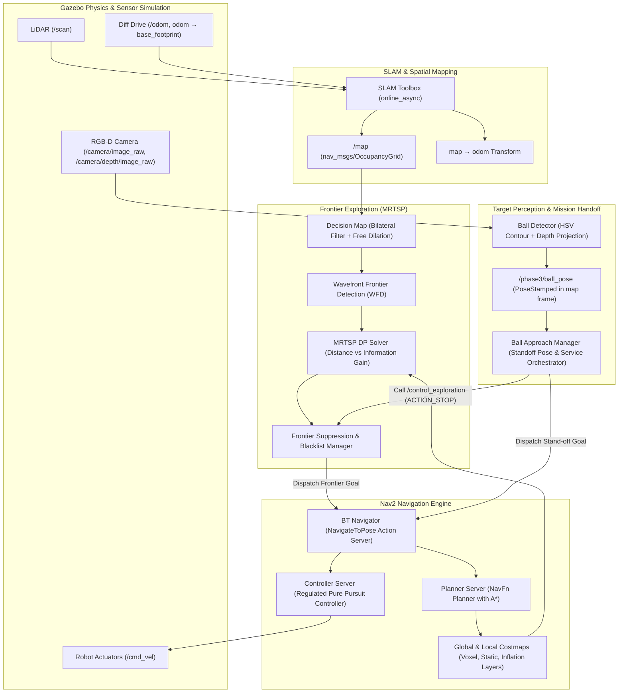

# Nav2 Phase 3: Autonomous Frontier Exploration, SLAM, Perception & Target Handoff Guide

Phase 3 is the culmination of the navigation stack: it combines **Simultaneous Localization and Mapping (SLAM)**, **MRTSP-based Autonomous Frontier Exploration**, **RGB-D Vision-Based Perception**, and **Dynamic Mission Coordination** into a fully autonomous mobile robotics pipeline.

Unlike Phase 1 (static map + AMCL) and Phase 2 (teleoperated SLAM), Phase 3 requires **zero human intervention**: the robot boots in an unknown house, autonomously explores and maps every room, filters unnavigable areas, and coordinates target interception.

---

## 1. Architectural Evolution: Phase 1 vs Phase 2 vs Phase 3

| Feature | Phase 1 (Known Map Navigation) | Phase 2 (Manual SLAM) | Phase 3 (Autonomous Exploration & Perception) |
|---|---|---|---|
| **Environment Knowledge** | Pre-mapped static YAML/PGM | Unknown at startup | Unknown at startup |
| **Localization Source** | AMCL (`map_server` + particle filter) | SLAM Toolbox (Karto/Ceres graph optimizer) | SLAM Toolbox (asynchronous online mode) |
| **`map → odom` Ownership** | AMCL | SLAM Toolbox | SLAM Toolbox |
| **Exploration Decision** | Manual human RViz goal | Manual teleoperation (`teleop_twist_keyboard`) | Autonomous MRTSP solver (`frontier_exploration_ros2`) |
| **Target Goal Selection** | Static user clicks in RViz | Arbitrary manual driving | Dynamic frontier clustering (WFD) + DP lookahead |
| **Path Controller** | DWB Local Planner (Trajectory Rollout) | DWB Local Planner | Regulated Pure Pursuit Controller (RPPC) |
| **Vision & Perception** | None | None | OpenCV HSV segmentation + 3D depth back-projection |
| **Mission Coordination** | None | None | Service-based exploration pause + standoff handoff |
| **Completion Criteria** | Goal pose reached | Human decides to save map | All frontiers exhausted/suppressed or target found |

---

## 2. End-to-End System Architecture



---

## 3. Autonomous Frontier Exploration Deep-Dive

### 3.1 What is a Frontier?
A **frontier cell** is an open, free-space cell ($Cost = 0$) that directly borders unknown, unobserved space ($Cost = -1$). When the robot travels to a frontier, its line-of-sight LiDAR sweeps into the unknown region, converting unknown cells into free space or obstacles and pushing the frontier boundary outward.

```
Known Obstacle (100) ─── [████████████]
Known Free Space (0) ─── [          ]  <-- Robot Location
Frontier Boundary    ─── [░░░░░░░░░░]  <-- Frontier (Free bordering Unknown)
Unknown Space (-1)   ─── [??????????]  <-- Target area to explore
```

### 3.2 Decision Map & Bilateral Filtering
Raw SLAM occupancy grids contain sensor edge noise, discrete rasterization artifacts, and dynamic discretization errors. To prevent generating hundreds of 1-cell false frontiers:
1. **Spatial & Range Bilateral Filtering**: A bilateral filter ($`\sigma_s = 2.0`$, $`\sigma_r = 30.0`$) smooths occupancy gradients while preserving sharp wall edges.
2. **Free-Space Dilation**: A 1-cell dilation kernel bridges narrow single-pixel sensor gaps near doorways.
3. **Thresholding**: Cells with cost below `occ_threshold: 65` are deemed navigable, allowing goals near wall openings without getting blocked by raw inflation margins.

### 3.3 Wavefront Frontier Detection (WFD)
Rather than naively scanning the entire $W \times H$ map matrix at every iteration:
1. **Map-Level BFS**: Starts a Breadth-First Search (BFS) from the robot's current position through known free space.
2. **Frontier-Level BFS**: When an unvisited frontier point is encountered, a sub-BFS expands to collect all contiguous frontier points into a single **Frontier Cluster**.
3. **Filtering**: Clusters smaller than `min_frontier_size_cells: 35` (approx. $1.75\text{ m}$ perimeter) are discarded as sensor artifacts or unreachable crevices.

### 3.4 Minimum Ratio Traveling Salesman Problem (MRTSP)
Selecting frontiers purely by Euclidean distance creates local dithering (visiting trivial micro-frontiers). Selecting purely by size causes massive cross-house oscillations. The explorer formulates frontier routing as an **MRTSP**:

$$\text{Score}(F_i) = \frac{\text{Information Gain}(F_i)^{w_s}}{\text{Traversal Cost}(\text{Pose}, F_i)^{w_d}}$$

- **Information Gain ($G$)**: Proxy based on cluster length and expected visible reveal volume.
- **Traversal Cost ($D$)**: Lower-bound time estimation taking linear speed ($v_{\max}$), angular reorientation ($\omega_{\max}$), and effective sensor range ($r_s = 1.5\text{ m}$) into account:
  $$D(P, F_i) = \max\left(0, \text{dist}(P, F_i) - r_s\right) + \Delta \theta \cdot \frac{v_{\max}}{\omega_{\max}}$$
- **Dynamic Programming (DP) Solver**: Evaluates a horizon of 10 lookahead candidates (`dp_planning_horizon: 10`, `dp_candidate_limit: 15`) rather than a purely greedy 1-step hop.

### 3.5 Frontier Suppression & Spatial Blacklisting
When a frontier goal lies in an unnavigable region (e.g. behind glass, narrow furniture gaps, or un-laserable staircases):
1. **Failure Monitoring**: If navigation to a frontier fails or stalls (progress $< 0.25\text{ m}$ in $25\text{ s}$), its failure count increments.
2. **Region Suppression**: After 4 failures (`frontier_suppression_attempt_threshold: 4`), a spatial square region (`base_size_m: 0.8\text{ m}`) is added to an active suppression memory.
3. **Suppression Filtering**: Frontiers inside active regions are excluded from candidate evaluation.
4. **TTL Pruning**: After 300 seconds (`frontier_suppression_timeout_s: 300.0`), suppression expires to allow re-evaluation if the environment topology changed.

---

## 4. SLAM & Nav2 Motion Control Stack

### 4.1 SLAM Toolbox (`online_async`)
- Uses **Ceres Solver** with `SPARSE_NORMAL_CHOLESKY` to solve nonlinear least-squares pose-graph optimization.
- **Odometry & Scan Matching**: Combines wheel odometry with Correlative Scan Matching (CSM) to build constraints between consecutive scans.
- **Loop Closure**: When revisiting previously explored rooms, loop closures constrain drift and update the entire map retroactively.
- **Map Update Rate**: Set to `map_update_interval: 0.5s` to ensure frontiers update quickly as the robot moves.

### 4.2 NavFn Global Planner
- Operates on the **Global Costmap** using Dijkstra/A* search algorithms.
- Configured with `tolerance: 0.25`: Provides optimal balance between avoiding strict planner rejection in narrow doorways and preventing excessive drift away from frontier dispatch centroids.

### 4.3 Regulated Pure Pursuit Controller (RPPC)
Phase 3 uses **RPPC** over the legacy DWB planner for superior stability in tight domestic corridors:
- **Curvature-Regulated Velocity Scaling**: Automatically slows the robot down when executing sharp turns:
  $$v_{\text{cmd}} = v_{\text{desired}} \cdot \min\left(1.0, \frac{r_{\text{turn}}}{r_{\text{min}}}\right)$$
- **Carrot Collision Lookahead**: Projects future poses along the path carrot ($1.0\text{ s}$ ahead) into the local costmap to prevent collisions with dynamic or newly mapped obstacles.
- **Rotate-to-Heading**: Rotates in place if the heading error exceeds $45^\circ$ ($0.785\text{ rad}$) before initiating linear drive.

### 4.4 Coordinate Transforms (TF Tree)
The exact coordinate transformation pipeline:

```text
map ──(SLAM Toolbox)──> odom ──(Diff-Drive Plugin)──> base_footprint ──(URDF)──> base_link
                                                                          ├──> base_scan (LiDAR)
                                                                          ├──> camera_link ──> camera_depth_frame
                                                                          └──> wheel_left_link / wheel_right_link
```

---

## 5. Vision Perception & Target Interception

### 5.1 Red Ball Detection Pipeline (OpenCV + 3D Depth)
The robot continuously processes RGB and Depth streams from its onboard RGB-D sensor:

```
[RGB Camera Image] ──> [HSV Conversion] ──> [Dual Red Mask (0-10 & 160-180)]
                            │
                            ▼
                    [Morphological Open/Close]
                            │
                            ▼
                  [Contour Detection] ──> [Circularity & Area Gating]
                                                 │
                                                 ▼ (u, v Center)
[Depth Image / Points] ───────────────> [3D De-projection (Z depth)]
                                                 │
                                                 ▼ (X_cam, Y_cam, Z_cam)
[TF: camera_frame → map] ──────────────> [Global Ball Coordinate (x, y)]
```

1. **Dual-Band HSV Thresholding**:
   - Red hue wraps around the $0^\circ / 180^\circ$ boundary in OpenCV HSV space:
     - Band 1: $H \in [0, 10], S \in [120, 255], V \in [70, 255]$
     - Band 2: $H \in [160, 180], S \in [120, 255], V \in [70, 255]$
2. **Geometric Validation**:
   - Computes contour area ($A$) and perimeter ($P$).
   - Calculates circularity metric $C = \frac{4\pi A}{P^2}$. Contours with $C < 0.65$ (e.g. rectangular red chairs or walls) are rejected.
3. **Pinhole Camera Back-Projection**:
   Given image pixel coordinates $(u, v)$ and depth $Z_c$ from the aligned depth image, intrinsic matrix parameters $(f_x, f_y, c_x, c_y)$ calculate 3D camera coordinates:
   $$X_c = \frac{(u - c_x) \cdot Z_c}{f_x}, \quad Y_c = \frac{(v - c_y) \cdot Z_c}{f_y}, \quad Z_c = \text{Depth}(u, v)$$
4. **TF Frame Transformation**:
   Transform $(X_c, Y_c, Z_c)$ from `camera_rgb_optical_frame` into the global `map` frame:
   $$P_{\text{map}} = T_{\text{map} \leftarrow \text{camera}} \cdot P_{\text{camera}}$$

### 5.2 Safe Stand-off Pose Generation
Navigating directly to the ball's center coordinate would command a collision. `ball_approach_manager`:
1. Computes the vector from robot to ball.
2. Generates candidate stand-off circles at distances $r \in \{0.70, 0.90, 1.10, 1.30\}\text{ m}$.
3. Sweeps angular offsets $\theta \in \{0^\circ, \pm 30^\circ, \pm 60^\circ, \pm 90^\circ\}$.
4. Queries the SLAM `/map` occupancy grid to ensure the candidate pose has at least 4 cells ($20\text{ cm}$) of clearance from any obstacle ($Cost \le 25$).
5. Orients the goal quaternion to point directly at the ball center:
   $$\theta_{\text{goal}} = \text{atan2}(y_{\text{ball}} - y_{\text{goal}}, x_{\text{ball}} - x_{\text{goal}})$$

### 5.3 Dynamic Exploration Interruption
When the ball is detected:
1. `ball_approach_manager` calls `/control_exploration` with `action: ACTION_STOP` to preempt the frontier explorer.
2. The active frontier goal in `bt_navigator` is cancelled.
3. The safe stand-off `NavigateToPose` goal is dispatched to Nav2.
4. Robot arrives at the stand-off location, facing the target ball.

---

## 6. Critical Engineering Lessons & Troubleshooting

### 1. Virtualization & Docker Desktop TF Jitter
- **Symptom**: `Lookup would require extrapolation into the future/past` or `Transform data too old`.
- **Root Cause**: Virtualized WSL2 backend experiences periodic CPU scheduling jitter of $0.5\text{–}1.5\text{ s}$, causing transforms to drop under default ROS 2 tolerances ($0.1\text{ s}$).
- **Solution**: Standardized `transform_tolerance: 2.0` across SLAM Toolbox, Nav2 Planner, Controller, and Behavior servers.

### 2. Goal Preemption Churn
- **Symptom**: Robot drove 3 seconds, stopped, restarted navigation to the same goal 4 times consecutively.
- **Root Cause**: `goal_preemption_enabled: true` was ray-casting visible reveal estimates from incomplete maps during transit, prematurely canceling long-distance routes.
- **Solution**: Set `goal_preemption_enabled: false`. Let the robot complete assigned routes while letting the MRTSP solver pick fresh goals upon arrival.

### 3. Planner Tolerance vs Silent Goal Drift
- **Symptom**: With `tolerance: 0.5`, the robot stopped short of frontier openings; with `tolerance: 0.05`, planning failed immediately near wall corners.
- **Root Cause**: NavFn tolerance acts as an allowable distance slack. Too large allows the robot to claim success in free space without seeing past obstacles; too small causes immediate aborts.
- **Solution**: Set `tolerance: 0.25` in `NavfnPlanner`, matching the robot radius ($0.22\text{ m}$).

### 4. Residual Wall Artifact Loops
- **Symptom**: After 90% mapping, the robot bounced between the same unreachable wall corners.
- **Root Cause**: Tiny frontier clusters (15–28 cells) near furniture were selected when no large frontiers remained.
- **Solution**: Raised `min_frontier_size_cells: 35`, configured `all_frontiers_suppressed_behavior: return_to_start`, and set `frontier_suppression_timeout_s: 300.0`.

---

## 7. ROS 2 Interface Specifications

### 7.1 Key Topics
| Topic Name | Message Type | Purpose | QoS |
|---|---|---|---|
| `/map` | `nav_msgs/msg/OccupancyGrid` | Global 2D SLAM grid map | Transient Local / Reliable |
| `/scan` | `sensor_msgs/msg/LaserScan` | 360-degree LiDAR distance measurements | Best Effort / Volatile |
| `/explore/frontiers` | `visualization_msgs/msg/MarkerArray` | All detected frontier points (green markers in RViz) | Volatile / Reliable |
| `/explore/selected_frontier`| `geometry_msgs/msg/PointStamped` | Currently active frontier centroid dispatched to Nav2 | Volatile / Reliable |
| `/phase3/ball_pose` | `geometry_msgs/msg/PoseStamped` | 3D estimated ball coordinate in `map` frame | Volatile / Reliable |
| `/phase3/mission_status` | `std_msgs/msg/String` | Human-readable system state & phase transitions | Volatile / Reliable |
| `/cmd_vel` | `geometry_msgs/msg/Twist` | Velocity command output to robot base | Volatile / Reliable |

### 7.2 Services & Actions
| Interface Name | Type | Protocol | Role |
|---|---|---|---|
| `/control_exploration` | `frontier_exploration_ros2/srv/ControlExploration` | Service | Runtime pause/resume/stop of frontier exploration |
| `/navigate_to_pose` | `nav2_msgs/action/NavigateToPose` | Action | Nav2 high-level navigation action client/server |
| `/slam_toolbox/save_map`| `slam_toolbox/srv/SaveMap` | Service | Serializes 2D PGM/YAML map to disk |

---

## 8. Verification & Diagnostic Commands

Run inside the Docker container (`docker exec -it nav2_phase3 bash`):

```bash
# 1. Source workspace environments
source /opt/ros/humble/setup.bash && source /opt/phase3_ws/install/setup.bash

# 2. Monitor frontier dispatch coordinates in real-time
ros2 topic echo /explore/selected_frontier

# 3. Check mission & perception transitions
ros2 topic echo /phase3/mission_status

# 4. Inspect current robot pose in SLAM map frame
ros2 run tf2_ros tf2_echo map base_footprint

# 5. Check active Nav2 action servers
ros2 action list

# 6. Manually pause or resume exploration via CLI
ros2 service call /control_exploration frontier_exploration_ros2/srv/ControlExploration "{action: 2}"  # STOP
ros2 service call /control_exploration frontier_exploration_ros2/srv/ControlExploration "{action: 1}"  # START

# 7. Save current generated map to disk
save_phase3_map my_phase3_house_map
```
