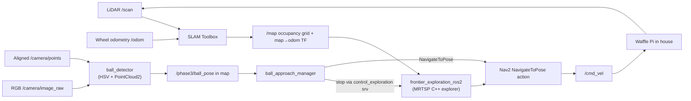

# Phase 3 — Autonomous exploration, SLAM, and RGB-D target approach

Phase 3 is the final, unknown-world lab. The robot starts without a map in the official TurtleBot3 **multi-room house**. It builds a 2-D occupancy grid with SLAM Toolbox, discovers and navigates to frontiers using **`frontier_exploration_ros2`** (an MRTSP-based C++ explorer), detects a red ball using RGB plus an aligned PointCloud2, transforms the ball into the `map` frame, and navigates to a safe stand-off point.

For the comprehensive deep-dive on MRTSP math, bilateral decision filtering, frontier suppression algorithms, Regulated Pure Pursuit control, and system debugging, see the **[Phase 3 Technical Guide](PHASE3_GUIDE.md)**.

The red ball is placed **deep in the kitchen area (~6 m from the robot start)**, forcing the robot to fully explore multiple rooms before it can detect and approach the target.

## Run

1. Stop Phase 1/2 first so Gazebo and ROS domains do not compete:

   ```powershell
   docker stop nav2_phase1 nav2_phase2 2>$null
   ```

2. From the repository root, build and start:

   ```powershell
   docker compose -f nav2_phase3_docker/docker-compose.yml up --build
   ```

   First build clones `frontier_exploration_ros2` from GitHub and compiles it, so it takes longer than later runs. First Gazebo launch can also take several minutes on Docker Desktop.

3. In RViz, set **Fixed Frame** to `map`. The default Nav2 display shows the map, costmaps, robot footprint, plan, and frontier markers at `/explore/frontiers`.

4. Follow the mission in a second terminal:

   ```powershell
   docker exec -it nav2_phase3 bash
   source /opt/ros/humble/setup.bash
   source /opt/phase3_ws/install/setup.bash

   # Frontier explorer events (selected targets, completion)
   ros2 topic echo /explore/selected_frontier
   ros2 topic echo exploration_complete

   # Ball detection and approach status
   ros2 topic echo /phase3/mission_status
   ros2 topic echo /phase3/perception_status
   ```

5. Manually stop or start the frontier explorer at runtime:

   ```bash
   frontier_exploration_ctl stop   # pause exploration
   frontier_exploration_ctl start  # resume exploration
   ```

Save both the occupancy map and SLAM pose graph after a run:

```powershell
docker exec -it nav2_phase3 bash /usr/local/bin/save_phase3_map.sh house_run_01
```

Files are persisted in `nav2_phase3_ws/maps/`.

---

## What the system does



---

## Node architecture

| Node | Package | Role |
|---|---|---|
| `slam_toolbox` | system | Produces `/map` and `map → odom` TF |
| `nav2_bringup navigation_launch` | system | Planner, controller, costmaps |
| **`frontier_explorer`** | **`frontier_exploration_ros2`** | **MRTSP-based autonomous exploration; sends Nav2 goals** |
| `ball_detector` | `nav2_phase3` | HSV red segmentation + PointCloud2 depth → `/phase3/ball_pose` |
| `ball_approach_manager` | `nav2_phase3` | Stops explorer via `/control_exploration` service; sends stand-off Nav2 goal |

> **What changed from the original design:**
> - `m-explore-ros2` / `explore_lite` has been **replaced** with `frontier_exploration_ros2`.
> - The old `mission_manager.py` (a Python BFS frontier explorer) has been **removed** — it was redundant with the external explorer.
> - `ball_approach_manager.py` now calls the `control_exploration` **service** (not the old `/explore/resume` Bool topic) to stop the explorer when the ball is found.

---

## Frames

| Frame | Owned by | Meaning |
|---|---|---|
| `map` | SLAM Toolbox | Globally consistent frame that moves when loop closure corrects the map. |
| `odom` | Gazebo differential drive | Smooth local dead-reckoning frame; drifts over time. |
| `base_footprint` | Robot state publisher / Gazebo | Robot pose on the floor. |
| `base_link` | Robot model | Body frame above `base_footprint`. |
| `camera_rgb_optical_frame` | Robot model | RGB-D/point-cloud measurement frame. |

The essential transform chain is `map → odom → base_footprint → ... → camera_rgb_optical_frame`. A cloud point is useful for navigation only after the detector transforms it from the camera frame to `map`.

---

## Topics worth inspecting

| Topic | Producer | Why it matters |
|---|---|---|
| `/map` | SLAM Toolbox | The growing occupancy grid; `-1` unknown, `0` free, `100` occupied. |
| `/scan` | LiDAR | Input to scan matching and mapping. |
| `/camera/image_raw` | RGB-D Gazebo sensor | RGB image used for HSV red segmentation. |
| `/camera/points` | RGB-D Gazebo sensor | Aligned 3-D points used to recover ball depth. |
| `/explore/frontiers` | `frontier_exploration_ros2` | MarkerArray of all current frontier candidates. |
| `/explore/selected_frontier` | `frontier_exploration_ros2` | The frontier goal currently being dispatched to Nav2. |
| `exploration_complete` | `frontier_exploration_ros2` | Published when all reachable frontiers are exhausted. |
| `/phase3/ball_pose` | `ball_detector` | Confirmed target position expressed in `map`. |
| `/phase3/mission_status` | `ball_approach_manager` | BALL_FOUND / APPROACHING / SUCCEEDED / APPROACH_FAILED. |
| `/global_costmap/costmap` | Nav2 | Global safety/traversability representation for planning. |
| `/local_costmap/costmap` | Nav2 | Short-range collision avoidance representation. |

---

## Frontier algorithm (`frontier_exploration_ros2`)

The explorer implements a WFD-style frontier detector enhanced with:

1. **Decision-map optimization** — bilateral filtering and dilation before frontier extraction to reduce noise and sharpen the known/unknown boundary.
2. **WFD frontier extraction** — expand through reachable map cells, detect frontier cells at the known/unknown boundary, group them into connected clusters.
3. **MRTSP-based ordering** — score frontier candidates using a Minimum Ratio Travelling Salesman Problem cost model that jointly considers distance, direction, and information gain.
4. **Greedy or bounded-DP dispatch** — configured here as `mrtsp_solver: greedy` (lower CPU for Docker Desktop). Switch to `dp` in `frontier_exploration.yaml` for better route quality.
5. **Goal preemption** — if the visible-reveal gain for the current target is already exhausted, replan early rather than wasting time completing a now-suboptimal route.
6. **Runtime control** — the `/control_exploration` service (exposed via `control_service_enabled: true`) lets `ball_approach_manager` stop the explorer cleanly when the ball is found.

---

## Perception algorithm

The target is a static 15 cm red sphere. `ball_detector` masks the RGB image in HSV using both red hue ranges, rejects small/non-circular contours, samples valid `x,y,z` values from the aligned cloud inside the contour, takes their median, then transforms the resulting point to `map`. Four successive observations are required before publishing a target pose. This reduces one-frame segmentation noise.

`ball_approach_manager` samples possible approach points around the mapped ball position. It picks a point that is known free and clear of occupied cells, about 0.7 m away, then faces the ball.

---

## RViz interpretation

- Greyscale occupancy grid: black = occupied, white = known free, grey = unknown.
- Costmaps: coloured inflation bands show increasing traversal cost near obstacles.
- Cyan robot footprint / laser dots: current robot geometry and LiDAR returns.
- `/explore/frontiers` MarkerArray: all current frontier cluster candidates (add as MarkerArray in RViz).
- `/explore/selected_frontier`: the active frontier goal being sent to Nav2.
- Red sphere on `/waypoints`: ball localized in the `map` frame (published by `ball_detector`).
- Green plan: Nav2's current global plan.

Do **not** use **2D Pose Estimate** during this mapping run. AMCL is not running, and SLAM Toolbox owns `map → odom`.

---

## Configuration

| File | Purpose |
|---|---|
| `config/frontier_exploration.yaml` | `frontier_exploration_ros2` parameters (solver, rates, thresholds) |
| `config/mapper_params_online_async.yaml` | SLAM Toolbox mapping parameters |
| `ros2_ws/src/nav2_phase3/config/phase3.yaml` | `ball_detector` and `ball_approach_manager` parameters |

**Ball position:** Override with `BALL_X` / `BALL_Y` in `docker-compose.yml`. Default is `(4.0, 1.5)` (kitchen area). Keep the ball on open floor, not inside furniture or walls.

---

## Useful experiments

- Watch frontiers being evaluated: add a **MarkerArray** display in RViz for `/explore/frontiers`.
- Watch the selected target: `ros2 topic echo /explore/selected_frontier`.
- View the RGB image: add an RViz **Image** display for `/camera/image_raw`.
- View cloud geometry: add an RViz **PointCloud2** display for `/camera/points`; set its color transformer to RGB.
- Switch to the DP MRTSP solver for higher-quality routes: set `mrtsp_solver: dp` in `config/frontier_exploration.yaml` and rebuild the image.
- Put the ball in a different room by editing `BALL_X` / `BALL_Y` in `docker-compose.yml`.
- Slow down frontier selection to reduce CPU load: lower `map_processing_rate_hz` to `0.25`.

---

## Project layout

```
nav2_phase3_docker/
├── Dockerfile                      # Clones frontier_exploration_ros2, builds both packages
├── docker-compose.yml              # Environment variables including ball position
├── start_nav2_phase3.sh            # Ordered startup: Gazebo → SLAM → Nav2 → Explorer → Phase3 nodes
├── save_phase3_map.sh              # Exports map PNG + pose graph
├── config/
│   ├── frontier_exploration.yaml   # frontier_exploration_ros2 parameters
│   └── mapper_params_online_async.yaml
├── models/
│   └── red_ball.sdf                # Gazebo target sphere model
└── ros2_ws/src/
    └── nav2_phase3/
        ├── nav2_phase3/
        │   ├── ball_detector.py        # HSV + PointCloud2 → /phase3/ball_pose
        │   └── ball_approach_manager.py # Stops explorer, sends Nav2 approach goal
        ├── launch/phase3.launch.py
        └── config/phase3.yaml
```
