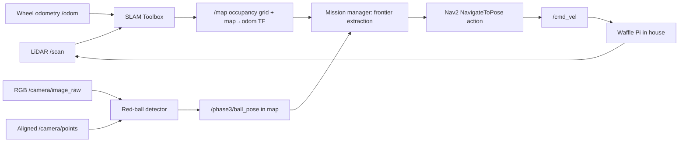

# Phase 3 — Autonomous exploration, SLAM, and RGB-D target approach

Phase 3 is the final, unknown-world lab. The robot starts without a map in the official TurtleBot3 **multi-room house**. It builds a 2-D occupancy grid with SLAM Toolbox, chooses frontiers (the boundary between known free and unknown space), sends those targets to Nav2, detects a red ball using RGB plus an aligned PointCloud2, transforms the ball into the `map` frame, and navigates to a safe stand-off point.

This is deliberately a small, readable implementation rather than a black-box exploration package: the important interview concepts are visible in two Python nodes.

## Run

1. Stop Phase 1/2 first so Gazebo and ROS domains do not compete:

   ```powershell
   docker stop nav2_phase1 nav2_phase2 2>$null
   ```

2. From the repository root, build and start:

   ```powershell
   docker compose -f nav2_phase3_docker/docker-compose.yml up --build
   ```

   First Gazebo launch can take several minutes on Docker Desktop. The startup script waits for Gazebo's service API and retries the stock robot spawn if its 30-second upstream timeout fires.

3. In RViz, set **Fixed Frame** to `map`. The default Nav2 display already shows the map, costmaps, robot footprint, plan, and `/waypoints` markers.

4. Follow the mission:

   ```powershell
   docker exec -it nav2_phase3 bash
   source /opt/ros/humble/setup.bash
   source /opt/phase3_ws/install/setup.bash
   ros2 topic echo /phase3/mission_status
   ros2 topic echo /phase3/perception_status
   ```

Save both the occupancy map and SLAM pose graph after a run:

```powershell
docker exec -it nav2_phase3 bash /usr/local/bin/save_phase3_map.sh house_run_01
```

Files are persisted in `nav2_phase3_ws/maps/`.

## What the system does



### Frames

| Frame | Owned by | Meaning |
|---|---|---|
| `map` | SLAM Toolbox | Globally consistent frame that moves when loop closure corrects the map. |
| `odom` | Gazebo differential drive | Smooth local dead-reckoning frame; drifts over time. |
| `base_footprint` | Robot state publisher / Gazebo | Robot pose on the floor. |
| `base_link` | Robot model | Body frame above `base_footprint`. |
| `camera_rgb_optical_frame` | Robot model | RGB-D/point-cloud measurement frame. |

The essential transform chain is `map → odom → base_footprint → ... → camera_rgb_optical_frame`. A cloud point is useful for navigation only after the detector transforms it from the camera frame to `map`.

### Topics worth inspecting

| Topic | Producer | Why it matters |
|---|---|---|
| `/map` | SLAM Toolbox | The growing occupancy grid; `-1` unknown, `0` free, `100` occupied. |
| `/scan` | LiDAR | Input to scan matching and mapping. |
| `/camera/image_raw` | RGB-D Gazebo sensor | RGB image used for HSV red segmentation. |
| `/camera/points` | RGB-D Gazebo sensor | Aligned 3-D points used to recover ball depth. |
| `/phase3/ball_pose` | `ball_detector` | Confirmed target position expressed in `map`. |
| `/phase3/mission_status` | `mission_manager` | State-machine decisions, goals, and completion. |
| `/global_costmap/costmap` | Nav2 | Global safety/traversability representation for planning. |
| `/local_costmap/costmap` | Nav2 | Short-range collision avoidance representation. |

## Frontier algorithm (the interview-sized version)

1. Mark every known free map cell adjacent to an unknown cell as a **frontier cell**.
2. Group neighboring frontier cells into clusters; discard tiny noisy clusters.
3. Choose a free, obstacle-clear cell near each cluster's center.
4. Score candidates by information proxy (cluster length) minus robot travel distance.
5. Send the best candidate as a `NavigateToPose` goal. Nav2 performs global planning, local obstacle avoidance, recovery, and velocity control.
6. On arrival, repeat with the updated map. If the ball is confirmed, cancel the frontier goal and send a stand-off approach goal instead.

It is not a replacement for a research-grade exploration stack. Its value is that each step is observable and directly maps to core robotics concepts.

## Perception algorithm

The target is a static 15 cm red sphere. `ball_detector` masks the RGB image in HSV using both red hue ranges, rejects small/non-circular contours, samples valid `x,y,z` values from the aligned cloud inside the contour, takes their median, then transforms the resulting point to `map`. Four successive observations are required before publishing a target pose. This reduces one-frame segmentation noise.

The mission manager samples possible approach points around the mapped ball. It picks a point that is known free and clear of occupied cells, about 0.7 m away, then faces the ball. This is why the robot approaches rather than trying to collide with the target itself.

## RViz interpretation

- Greyscale occupancy grid: black = occupied, white = known free, grey = unknown.
- Costmaps: coloured inflation bands are increasing traversal cost near obstacles; they are not the SLAM map. A map may say “free” while a costmap temporarily blocks it for safety.
- Cyan robot footprint / laser dots: current robot geometry and LiDAR returns.
- Green sphere on `/waypoints`: currently selected frontier goal.
- Red sphere on `/waypoints`: ball localized in the `map` frame.
- Green plan: Nav2's current global plan. It changes as mapping and costmaps change.

Do **not** use **2D Pose Estimate** during this mapping run. AMCL is not running, and SLAM Toolbox owns `map → odom`. Use **2D Nav Goal** only when you intentionally want to interrupt/compare with manual Nav2 navigation; the autonomous mission normally sends its own goals.

## Useful experiments

- Watch the state: `ros2 topic echo /phase3/mission_status`.
- Confirm sensor alignment: `ros2 topic hz /camera/points` and `ros2 topic echo /phase3/ball_pose --once`.
- View the RGB image: add an RViz **Image** display for `/camera/image_raw`.
- View cloud geometry: add an RViz **PointCloud2** display for `/camera/points`; set its color transformer to RGB if available.
- Change ball placement before launch with `BALL_X` and `BALL_Y` in `docker-compose.yml`, then recreate the container. Keep it on an open floor, not in furniture/walls.
- Set `finish_mapping_before_approach: true` in `ros2_ws/src/nav2_phase3/config/phase3.yaml` when you want to map all reachable frontiers before pursuing a detected ball.

## Project layout

- `ros2_ws/src/nav2_phase3/nav2_phase3/mission_manager.py` — frontier selection, Nav2 goals, and approach state machine.
- `ros2_ws/src/nav2_phase3/nav2_phase3/ball_detector.py` — HSV segmentation and PointCloud2-to-map localization.
- `models/red_ball.sdf` — Gazebo target.
- `start_nav2_phase3.sh` — ordered simulation/SLAM/Nav2/mission startup.
- `save_phase3_map.sh` — exports PNG-compatible occupancy map plus pose graph.
